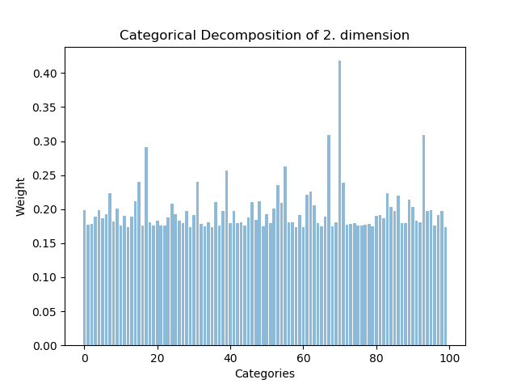
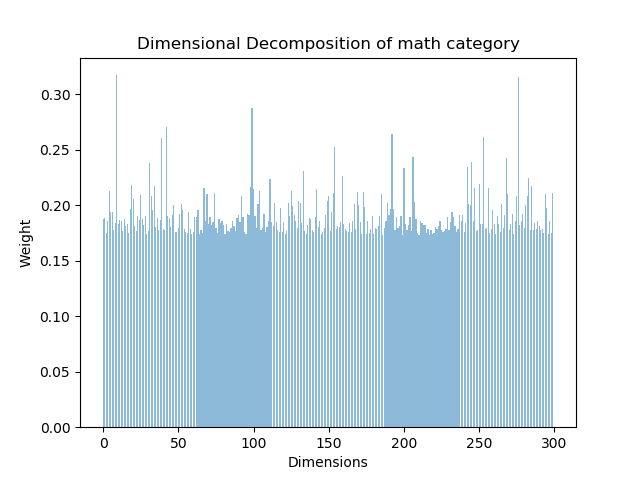
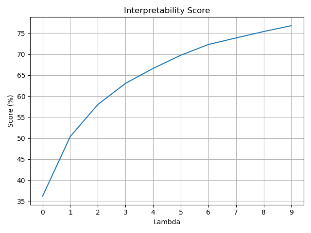
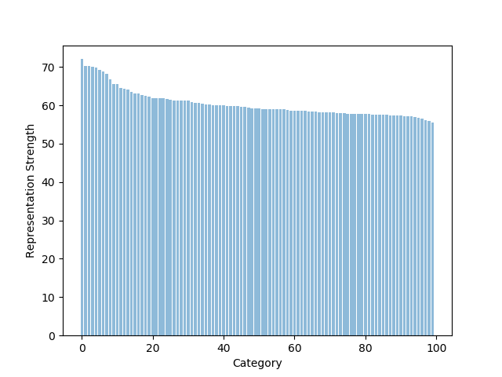
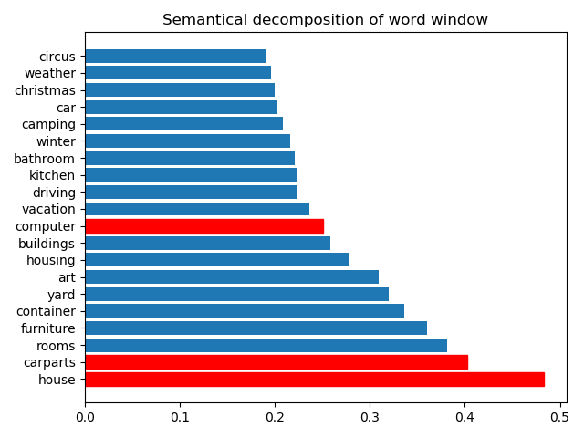
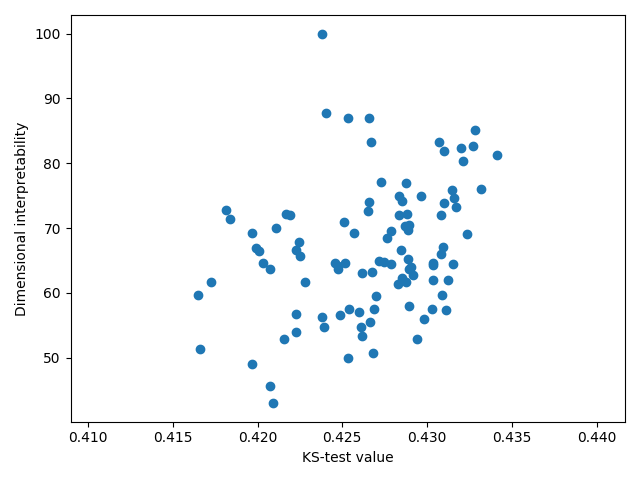

# Plotting utility scripts

## **Categorical Decomposition**

`
python categorical_decomposition.py <input_file> <dimension> [-h] [--output_file OUTPUT_FILE]
`

- **input_file** - Bhattacharya distance matrix (w_b.npy)
- **dimension** - The dimension to decompose
- **output_file** - Output PNG file (Optional)

**Output:**  

## **Dimensional Decomposition**

`
python dimensional_decomposition.py <semcat_dir> <input_file> <category> [-h] [--output_file OUTPUT_FILE]
`

- **semcat_dir** - Path to the SemCat categories directory (f.e. "semcat/Categories")
- **input_file** - Bhattacharya distance matrix (w_b.npy)
- **category** - The Category to decompose (f.e. 'math')
- **output_file** - Output PNG file (Optional)

**Output:**  

## **Interpretability Score**

`
python interpretability_score.py <input_file> [-h] [--output_file OUTPUT_FILE] 
`

- **input_file** - Input file which contains the list of the scores
- **output_file** - Output PNG file (Optional)

**Output:**  

## **Representation Strength**

`
python representation_strength.py <input_file> <semcat_dir> [-h] [--output_file OUTPUT_FILE]
`

- **input_file** - Bhattacharya distance matrix (w_b.npy)
- **semcat_dir** - Path to the SemCat categories directory (f.e. "semcat/Categories")
- **output_file** - Output PNG file (Optional)

**Output:**  

## **Semantical Decomposition**

`
python semantic_decomposition.py <semcat_dir> <input_file> [-h] [--output_file OUTPUT_FILE]
`

- **semcat_dir** - Path to the SemCat categories directory (f.e. "semcat/Categories")
- **input_file** - Embedding-Category matrix (I.npy)
- **output_file** - Output PNG file (Optional)

**Output:**  

## **Dimensional interpretability according to KS-test value**

`
python ks_dimensional_interpretability.py <input_file> <embedding_file> <semcat_dir>  
[-h] [--lines_to_read LINES_TO_READ] [--output_file OUTPUT_FILE]
`

- **input_file** - Embedding-Category matrix (I.npy)
- **embedding_file** - Embedding file (Use the same embedding file like in the evaluation)
- **semcat_dir** - Path to the SemCat categories directory (f.e. "semcat/Categories")
- **lines_to_read** - Maximum number of vectors to read from the embedding file. Default -1 (all). 
                      (Read the same amount of lines like in the evaluation)
- **output_file** - Output PNG file (Optional)

**Output:**  
